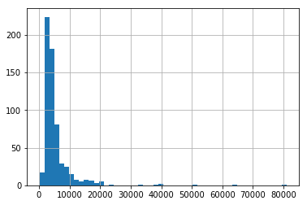
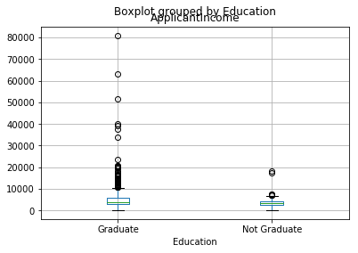
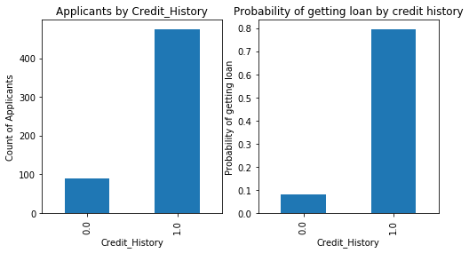
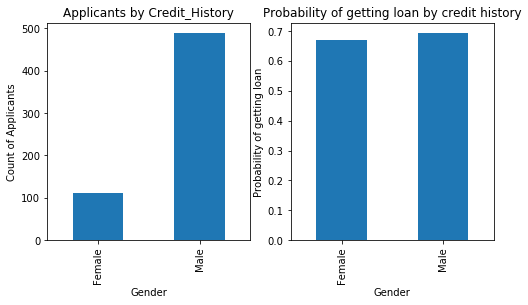
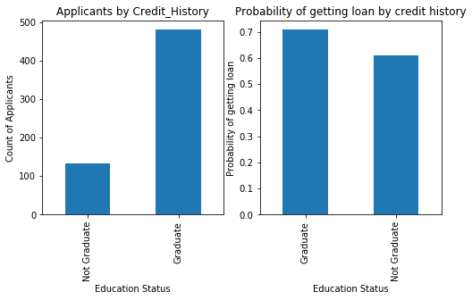
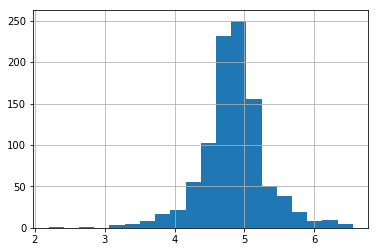

<center>
    <h1>Exercise 4: Data Analysis with Python</h1>
    <h2>By Matan Yeshurun and Alon Galperin</h2>
    <h3>Our Task: Loan Prediction Practice Problem</h3>
</center>

Dream Housing Finance company deals in all home loans. They have presence across all urban, semi urban and rural areas. Customer first apply for home loan after that company validates the customer eligibility for loan.

The company wants to automate the loan eligibility process (real time) based on customer detail provided while filling online application form. These details are Gender, Marital Status, Education, Number of Dependents, Income, Loan Amount, Credit History and others. To automate this process, they have given a problem to identify the customers segments, those are eligible for loan amount so that they can specifically target these customers. Here they have provided a partial data set.

## The Data

Variable | Description
----------|--------------
Loan_ID | Unique Loan ID
Gender | Male/ Female
Married | Applicant married (Y/N)
Dependents | Number of dependents
Education | Applicant Education (Graduate/ Under Graduate)
Self_Employed | Self employed (Y/N)
ApplicantIncome | Applicant income
CoapplicantIncome | Coapplicant income
LoanAmount | Loan amount in thousands
Loan_Amount_Term | Term of loan in months
Credit_History | credit history meets guidelines
Property_Area | Urban/ Semi Urban/ Rural
Loan_Status | Loan approved (Y/N)

## Setups

To begin, start iPython interface in Inline Pylab.
This opens up iPython notebook in pylab environment, which has a few useful libraries already imported. Also, you will be able to plot your data inline, which makes this a really good environment for interactive data analysis


```python
%pylab inline
```

    Populating the interactive namespace from numpy and matplotlib
    

Following are the libraries we will use during this task:
- numpy
- matplotlib
- pandas


```python
import pandas as pd
import numpy as np
import matplotlib as plt
import matplotlib.pyplot as plt
from copy import deepcopy
pd.options.mode.chained_assignment = None  # default='warn'
from sklearn.preprocessing import LabelEncoder
```

### Now we can read the data:


```python
df_train = pd.read_csv("./data/train.csv") #Reading the dataset in a dataframe using Pandas
df_test = pd.read_csv("./data/test.csv")
```

We will shuffle the records, since it good fo the predictions algorithms fit process.


```python
from sklearn.utils import shuffle
df_train = shuffle(df_train)
df_test = shuffle(df_test)

df_test.head()
```


<div>
<table border="1" class="dataframe">
  <thead>
    <tr style="text-align: right;">
      <th></th>
      <th>Loan_ID</th>
      <th>Gender</th>
      <th>Married</th>
      <th>Dependents</th>
      <th>Education</th>
      <th>Self_Employed</th>
      <th>ApplicantIncome</th>
      <th>CoapplicantIncome</th>
      <th>LoanAmount</th>
      <th>Loan_Amount_Term</th>
      <th>Credit_History</th>
      <th>Property_Area</th>
    </tr>
  </thead>
  <tbody>
    <tr>
      <th>74</th>
      <td>LP001386</td>
      <td>Male</td>
      <td>Yes</td>
      <td>0</td>
      <td>Not Graduate</td>
      <td>No</td>
      <td>4750</td>
      <td>3583</td>
      <td>144.0</td>
      <td>360.0</td>
      <td>1.0</td>
      <td>Semiurban</td>
    </tr>
    <tr>
      <th>5</th>
      <td>LP001054</td>
      <td>Male</td>
      <td>Yes</td>
      <td>0</td>
      <td>Not Graduate</td>
      <td>Yes</td>
      <td>2165</td>
      <td>3422</td>
      <td>152.0</td>
      <td>360.0</td>
      <td>1.0</td>
      <td>Urban</td>
    </tr>
    <tr>
      <th>13</th>
      <td>LP001094</td>
      <td>Male</td>
      <td>Yes</td>
      <td>2</td>
      <td>Graduate</td>
      <td>NaN</td>
      <td>12173</td>
      <td>0</td>
      <td>166.0</td>
      <td>360.0</td>
      <td>0.0</td>
      <td>Semiurban</td>
    </tr>
    <tr>
      <th>234</th>
      <td>LP002311</td>
      <td>Female</td>
      <td>Yes</td>
      <td>0</td>
      <td>Graduate</td>
      <td>No</td>
      <td>2157</td>
      <td>1788</td>
      <td>104.0</td>
      <td>360.0</td>
      <td>1.0</td>
      <td>Urban</td>
    </tr>
    <tr>
      <th>325</th>
      <td>LP002802</td>
      <td>Male</td>
      <td>No</td>
      <td>0</td>
      <td>Graduate</td>
      <td>No</td>
      <td>2875</td>
      <td>2416</td>
      <td>95.0</td>
      <td>6.0</td>
      <td>0.0</td>
      <td>Semiurban</td>
    </tr>
  </tbody>
</table>
</div>


# Data Exploration

### Quick view of the data

Once we have read the dataset, we can have a look at few top rows by using the function head()


```python
df_train.head(20)
```


<div>
<table border="1" class="dataframe">
  <thead>
    <tr style="text-align: right;">
      <th></th>
      <th>Loan_ID</th>
      <th>Gender</th>
      <th>Married</th>
      <th>Dependents</th>
      <th>Education</th>
      <th>Self_Employed</th>
      <th>ApplicantIncome</th>
      <th>CoapplicantIncome</th>
      <th>LoanAmount</th>
      <th>Loan_Amount_Term</th>
      <th>Credit_History</th>
      <th>Property_Area</th>
      <th>Loan_Status</th>
    </tr>
  </thead>
  <tbody>
    <tr>
      <th>484</th>
      <td>LP002543</td>
      <td>Male</td>
      <td>Yes</td>
      <td>2</td>
      <td>Graduate</td>
      <td>No</td>
      <td>8333</td>
      <td>0.0</td>
      <td>246.0</td>
      <td>360.0</td>
      <td>1.0</td>
      <td>Semiurban</td>
      <td>Y</td>
    </tr>
    <tr>
      <th>66</th>
      <td>LP001228</td>
      <td>Male</td>
      <td>No</td>
      <td>0</td>
      <td>Not Graduate</td>
      <td>No</td>
      <td>3200</td>
      <td>2254.0</td>
      <td>126.0</td>
      <td>180.0</td>
      <td>0.0</td>
      <td>Urban</td>
      <td>N</td>
    </tr>
    <tr>
      <th>46</th>
      <td>LP001138</td>
      <td>Male</td>
      <td>Yes</td>
      <td>1</td>
      <td>Graduate</td>
      <td>No</td>
      <td>5649</td>
      <td>0.0</td>
      <td>44.0</td>
      <td>360.0</td>
      <td>1.0</td>
      <td>Urban</td>
      <td>Y</td>
    </tr>
    <tr>
      <th>177</th>
      <td>LP001610</td>
      <td>Male</td>
      <td>Yes</td>
      <td>3+</td>
      <td>Graduate</td>
      <td>No</td>
      <td>5516</td>
      <td>11300.0</td>
      <td>495.0</td>
      <td>360.0</td>
      <td>0.0</td>
      <td>Semiurban</td>
      <td>N</td>
    </tr>
    <tr>
      <th>290</th>
      <td>LP001936</td>
      <td>Male</td>
      <td>Yes</td>
      <td>0</td>
      <td>Graduate</td>
      <td>No</td>
      <td>3075</td>
      <td>2416.0</td>
      <td>139.0</td>
      <td>360.0</td>
      <td>1.0</td>
      <td>Rural</td>
      <td>Y</td>
    </tr>
    <tr>
      <th>278</th>
      <td>LP001907</td>
      <td>Male</td>
      <td>Yes</td>
      <td>0</td>
      <td>Graduate</td>
      <td>No</td>
      <td>14583</td>
      <td>0.0</td>
      <td>436.0</td>
      <td>360.0</td>
      <td>1.0</td>
      <td>Semiurban</td>
      <td>Y</td>
    </tr>
    <tr>
      <th>367</th>
      <td>LP002188</td>
      <td>Male</td>
      <td>No</td>
      <td>0</td>
      <td>Graduate</td>
      <td>No</td>
      <td>5124</td>
      <td>0.0</td>
      <td>124.0</td>
      <td>NaN</td>
      <td>0.0</td>
      <td>Rural</td>
      <td>N</td>
    </tr>
    <tr>
      <th>341</th>
      <td>LP002116</td>
      <td>Female</td>
      <td>No</td>
      <td>0</td>
      <td>Graduate</td>
      <td>No</td>
      <td>2378</td>
      <td>0.0</td>
      <td>46.0</td>
      <td>360.0</td>
      <td>1.0</td>
      <td>Rural</td>
      <td>N</td>
    </tr>
    <tr>
      <th>572</th>
      <td>LP002855</td>
      <td>Male</td>
      <td>Yes</td>
      <td>2</td>
      <td>Graduate</td>
      <td>No</td>
      <td>16666</td>
      <td>0.0</td>
      <td>275.0</td>
      <td>360.0</td>
      <td>1.0</td>
      <td>Urban</td>
      <td>Y</td>
    </tr>
    <tr>
      <th>318</th>
      <td>LP002043</td>
      <td>Female</td>
      <td>No</td>
      <td>1</td>
      <td>Graduate</td>
      <td>No</td>
      <td>3541</td>
      <td>0.0</td>
      <td>112.0</td>
      <td>360.0</td>
      <td>NaN</td>
      <td>Semiurban</td>
      <td>Y</td>
    </tr>
    <tr>
      <th>295</th>
      <td>LP001949</td>
      <td>Male</td>
      <td>Yes</td>
      <td>3+</td>
      <td>Graduate</td>
      <td>NaN</td>
      <td>4416</td>
      <td>1250.0</td>
      <td>110.0</td>
      <td>360.0</td>
      <td>1.0</td>
      <td>Urban</td>
      <td>Y</td>
    </tr>
    <tr>
      <th>223</th>
      <td>LP001749</td>
      <td>Male</td>
      <td>Yes</td>
      <td>0</td>
      <td>Graduate</td>
      <td>No</td>
      <td>7578</td>
      <td>1010.0</td>
      <td>175.0</td>
      <td>NaN</td>
      <td>1.0</td>
      <td>Semiurban</td>
      <td>Y</td>
    </tr>
    <tr>
      <th>299</th>
      <td>LP001963</td>
      <td>Male</td>
      <td>Yes</td>
      <td>1</td>
      <td>Graduate</td>
      <td>No</td>
      <td>2014</td>
      <td>2925.0</td>
      <td>113.0</td>
      <td>360.0</td>
      <td>1.0</td>
      <td>Urban</td>
      <td>N</td>
    </tr>
    <tr>
      <th>332</th>
      <td>LP002100</td>
      <td>Male</td>
      <td>No</td>
      <td>NaN</td>
      <td>Graduate</td>
      <td>No</td>
      <td>2833</td>
      <td>0.0</td>
      <td>71.0</td>
      <td>360.0</td>
      <td>1.0</td>
      <td>Urban</td>
      <td>Y</td>
    </tr>
    <tr>
      <th>348</th>
      <td>LP002137</td>
      <td>Male</td>
      <td>Yes</td>
      <td>0</td>
      <td>Graduate</td>
      <td>No</td>
      <td>6333</td>
      <td>4583.0</td>
      <td>259.0</td>
      <td>360.0</td>
      <td>NaN</td>
      <td>Semiurban</td>
      <td>Y</td>
    </tr>
    <tr>
      <th>226</th>
      <td>LP001754</td>
      <td>Male</td>
      <td>Yes</td>
      <td>NaN</td>
      <td>Not Graduate</td>
      <td>Yes</td>
      <td>4735</td>
      <td>0.0</td>
      <td>138.0</td>
      <td>360.0</td>
      <td>1.0</td>
      <td>Urban</td>
      <td>N</td>
    </tr>
    <tr>
      <th>470</th>
      <td>LP002515</td>
      <td>Male</td>
      <td>Yes</td>
      <td>1</td>
      <td>Graduate</td>
      <td>Yes</td>
      <td>3450</td>
      <td>2079.0</td>
      <td>162.0</td>
      <td>360.0</td>
      <td>1.0</td>
      <td>Semiurban</td>
      <td>Y</td>
    </tr>
    <tr>
      <th>445</th>
      <td>LP002429</td>
      <td>Male</td>
      <td>Yes</td>
      <td>1</td>
      <td>Graduate</td>
      <td>Yes</td>
      <td>3466</td>
      <td>1210.0</td>
      <td>130.0</td>
      <td>360.0</td>
      <td>1.0</td>
      <td>Rural</td>
      <td>Y</td>
    </tr>
    <tr>
      <th>287</th>
      <td>LP001926</td>
      <td>Male</td>
      <td>Yes</td>
      <td>0</td>
      <td>Graduate</td>
      <td>No</td>
      <td>3704</td>
      <td>2000.0</td>
      <td>120.0</td>
      <td>360.0</td>
      <td>1.0</td>
      <td>Rural</td>
      <td>Y</td>
    </tr>
    <tr>
      <th>549</th>
      <td>LP002777</td>
      <td>Male</td>
      <td>Yes</td>
      <td>0</td>
      <td>Graduate</td>
      <td>No</td>
      <td>2785</td>
      <td>2016.0</td>
      <td>110.0</td>
      <td>360.0</td>
      <td>1.0</td>
      <td>Rural</td>
      <td>Y</td>
    </tr>
  </tbody>
</table>
</div>


We can look at summary of numerical fields by using describe() function


```python
df_train.describe() # get the summary of numerical variables
```


<div>
<table border="1" class="dataframe">
  <thead>
    <tr style="text-align: right;">
      <th></th>
      <th>ApplicantIncome</th>
      <th>CoapplicantIncome</th>
      <th>LoanAmount</th>
      <th>Loan_Amount_Term</th>
      <th>Credit_History</th>
    </tr>
  </thead>
  <tbody>
    <tr>
      <th>count</th>
      <td>614.000000</td>
      <td>614.000000</td>
      <td>592.000000</td>
      <td>600.00000</td>
      <td>564.000000</td>
    </tr>
    <tr>
      <th>mean</th>
      <td>5403.459283</td>
      <td>1621.245798</td>
      <td>146.412162</td>
      <td>342.00000</td>
      <td>0.842199</td>
    </tr>
    <tr>
      <th>std</th>
      <td>6109.041673</td>
      <td>2926.248369</td>
      <td>85.587325</td>
      <td>65.12041</td>
      <td>0.364878</td>
    </tr>
    <tr>
      <th>min</th>
      <td>150.000000</td>
      <td>0.000000</td>
      <td>9.000000</td>
      <td>12.00000</td>
      <td>0.000000</td>
    </tr>
    <tr>
      <th>25%</th>
      <td>2877.500000</td>
      <td>0.000000</td>
      <td>100.000000</td>
      <td>360.00000</td>
      <td>1.000000</td>
    </tr>
    <tr>
      <th>50%</th>
      <td>3812.500000</td>
      <td>1188.500000</td>
      <td>128.000000</td>
      <td>360.00000</td>
      <td>1.000000</td>
    </tr>
    <tr>
      <th>75%</th>
      <td>5795.000000</td>
      <td>2297.250000</td>
      <td>168.000000</td>
      <td>360.00000</td>
      <td>1.000000</td>
    </tr>
    <tr>
      <th>max</th>
      <td>81000.000000</td>
      <td>41667.000000</td>
      <td>700.000000</td>
      <td>480.00000</td>
      <td>1.000000</td>
    </tr>
  </tbody>
</table>
</div>


<strong>We can see that the numrical variables are:</strong>  
- ApplicantIncome  
- CoapplicantIncome  
- LoanAmount  
- Loan_Amount_Term  
- Credit_History

## Distribution Analysis

Now that we are familiar with basic data characteristics, let us study distribution of various variables.  
Let us start with numeric variables – namely <strong>ApplicantIncome and LoanAmount.</strong>

### ApplicantIncome Analysis

Lets start by plotting the histogram of ApplicantIncome using the following commands:


```python
df_train['ApplicantIncome'].hist(bins=50)
plt.show()
```





Here we observe that there are few extreme values. This is also the reason why 50 bins are required to depict the distribution clearly.  
  
Next, we look at box plots to understand the distributions.  
Box plot can be plotted by:


```python
df_train.boxplot(column='ApplicantIncome')
```


    <matplotlib.axes._subplots.AxesSubplot at 0x120dceb8>


This confirms the presence of a lot of outliers/extreme values.  
This can be attributed to the income disparity in the society. Part of this can be driven by the fact that we are looking at people with different education levels. Let us segregate them by Education:


```python
df_train.boxplot(column='ApplicantIncome', by = 'Education')
plt.show()
```





We can see that there is no substantial different between the mean income of graduate and non-graduates. But there are a higher number of graduates with very high incomes, which are appearing to be the outliers.

Count missing values in **ApplicantIncome**:


```python
df_train['ApplicantIncome'].isnull().ravel().sum()
```


    0


**Missig Values conclusion**:  
We can see that **ApplicantIncome column has 0** missing values

### LoanAmount Analysis

Plot the histogram and boxplot of LoanAmount


```python
df_train['LoanAmount'].hist(bins=50)
```


    <matplotlib.axes._subplots.AxesSubplot at 0x11a2bc88>


LoanAmount Box plot


```python
df_train.boxplot(column='LoanAmount')
plt.show()
```


Again, there are some extreme values.  

Count missing values in **LoanAmount**:


```python
df_train['LoanAmount'].isnull().ravel().sum()
```


    22


**Missig Values conclusion**:  
We can see that **LoanAmount has column has 22** missing values

Conclusions regrading ApplicantIncome and LoanAmount:

Clearly, both ApplicantIncome and LoanAmount require some amount of data munging.  
LoanAmount has missing and well as extreme values values, while ApplicantIncome has a few extreme values, which demand deeper understanding. We will take this up in coming sections.  
  
Variable | Missing Values | Are there Extreme Values?
----------|-------------------------------
ApplicantIncome | 0 | yes
LoanAmount | 22 | yes

## Categorical variable analysis

Check what are the categical columns:


```python
cols = df_train.columns
num_cols = df_train._get_numeric_data().columns
list(set(cols) - set(num_cols))
```


    ['Property_Area',
     'Loan_ID',
     'Gender',
     'Married',
     'Self_Employed',
     'Loan_Status',
     'Dependents',
     'Education']


Frequency Table for Credit History:


```python
Credit_History_value_count = df_train['Credit_History'].value_counts(ascending=True)
Credit_History_value_count
```


    0.0     89
    1.0    475
    Name: Credit_History, dtype: int64


Probability of getting loan for each Credit History class:


```python
Credit_History_probability = df_train.pivot_table(values='Loan_Status',index=['Credit_History'],aggfunc=lambda x: x.map({'Y':1,'N':0}).mean())

#Credit_History_probability = Credit_History_probability['Loan_Status']
Credit_History_probability
```


    Credit_History
    0.0    0.078652
    1.0    0.795789
    Name: Loan_Status, dtype: float64


This can be plotted as a bar chart using the “matplotlib” library with following code:


```python
import matplotlib.pyplot as plt

fig = plt.figure(figsize=(8,4))
ax1 = fig.add_subplot(121)
ax1.set_xlabel('Credit_History')
ax1.set_ylabel('Count of Applicants')
ax1.set_title("Applicants by Credit_History")
Credit_History_value_count.plot(kind='bar')

ax2 = fig.add_subplot(122)
Credit_History_probability.plot(kind = 'bar')

ax2.set_xlabel('Credit_History')
ax2.set_ylabel('Probability of getting loan')
ax2.set_title("Probability of getting loan by credit history")

plt.show()
```





we want to check if there the gender has any effect on the decision of giving loan


```python
gender_value_count = df_train['Gender'].value_counts(ascending=True)
gender_value_count
```


    Female    112
    Male      489
    Name: Gender, dtype: int64


```python
gender_value_probability = df_train.pivot_table(values='Loan_Status',index=['Gender'],aggfunc=lambda x: x.map({'Y':1,'N':0}).mean())
#gender_value_probability = gender_value_probability['Loan_Status']
gender_value_probability
```


    Gender
    Female    0.669643
    Male      0.693252
    Name: Loan_Status, dtype: float64


```python
fig = plt.figure(figsize=(8,4))
ax1 = fig.add_subplot(121)
ax1.set_xlabel('Gender')
ax1.set_ylabel('Count of Applicants')
ax1.set_title("Applicants by Credit_History")
gender_value_count.plot(kind='bar')

ax2 = fig.add_subplot(122)
gender_value_probability.plot(kind = 'bar')

ax2.set_xlabel('Gender')
ax2.set_ylabel('Probability of getting loan')
ax2.set_title("Probability of getting loan by credit history")

plt.show()
```





We can see that there is no relation to the gender. The odds are the same whether.

Finally we want to check if Education status has significant effect:


```python
education_value_count = df_train['Education'].value_counts(ascending=True)
education_value_count
```


    Not Graduate    134
    Graduate        480
    Name: Education, dtype: int64


```python
education_value_probability = df_train.pivot_table(values='Loan_Status',index=['Education'],aggfunc=lambda x: x.map({'Y':1,'N':0}).mean())
#education_value_probability = education_value_probability['Loan_Status']
education_value_probability
```


    Education
    Graduate        0.708333
    Not Graduate    0.611940
    Name: Loan_Status, dtype: float64


```python
fig = plt.figure(figsize=(8,4))
ax1 = fig.add_subplot(121)
ax1.set_xlabel('Education Status')
ax1.set_ylabel('Count of Applicants')
ax1.set_title("Applicants by Credit_History")
education_value_count.plot(kind='bar')

ax2 = fig.add_subplot(122)
education_value_probability.plot(kind = 'bar')

ax2.set_xlabel('Education Status')
ax2.set_ylabel('Probability of getting loan')
ax2.set_title("Probability of getting loan by credit history")

plt.show()
```





We can see that the significance is rather small

## Data Munging - Fill Missing Values and  Smooth Extreme Values

In this section we will deal with the extreme values and filling of missing values.  
  
In addition to these problems with numerical fields, we should also look at the non-numerical fields i.e. Gender, Property_Area, Married, Education and Dependents to see, if they contain any useful information.

For this section we will combine the train and test sets to one combined dataset.  
At the end of this section we will split the data again to same train and test records


```python
train_rows = len(df_train) # this variable will tell us where the train records are ending, and the test records are starting

total_data = df_train.append(df_test)
```

### Check missing values in the dataset

Motivation:  
Let us look at missing values in all the variables because most of the models don’t work with missing data and even if they do, imputing them helps more often than not.  
So, let us check the number of nulls / NaNs in the dataset.

<h1 style="color:blue">Comment:</h1>
<p>
Regarding filling the missing values in categorical attributs:  
We wrote a complex method for filling missing values using knn-algorithm.  
But when we really checked the destribution of the missing values in every column -  
we saw that in all categorical attributes there is an really segnificant majority for one of the values.  
<br />
In conclusion we decided not to use the knn function and to use 'Mode' to fill the missing values, in order to keep things simple.  
We also deleted the knn function from the code in order to make it more readable.  
<br/>
Link to the knn function we wrote, stored on seperate file:  
<a href="https://github.com/matan-yes/ex4/blob/master/knn%20fill%20missing%20values.ipynb">Link to knn algorithm</a>
</p>

**Check counts of missing values:**


```python
total_data.apply(lambda x: sum(x.isnull()),axis=0)
```


    ApplicantIncome        0
    CoapplicantIncome      0
    Credit_History        79
    Dependents            25
    Education              0
    Gender                24
    LoanAmount            27
    Loan_Amount_Term      20
    Loan_ID                0
    Loan_Status          367
    Married                3
    Property_Area          0
    Self_Employed         55
    dtype: int64


Note: We consider 0 in LoanAmount as missing value.  
Now we check how many 0 there are in LoanAmount:


```python
if 0 in total_data['LoanAmount'].value_counts():
    print('number of records with 0 in Loan Amount: %d' %total_data['LoanAmount'].value_counts()[0])
else:
    print('no records with 0 in Loan Amount')
```

    no records with 0 in Loan Amount
    

### How to fill missing values in LoanAmount?

We want to fill the missing data in LoanAmount following the next hypothesis:  
A key hypothesis is that whether a person is educated or self-employed can combine to give a good estimate of loan amount.  
  
   
But first, we have to ensure that each of Self_Employed and Education variables should not have a missing values.

As we say earlier, Self_Employed has some missing values. Let’s look at the frequency table:


```python
total_data['Self_Employed'].value_counts()
```


    No     807
    Yes    119
    Name: Self_Employed, dtype: int64


Since ~87% values are “No”, it is safe to impute the missing values as “No” as there is a high probability of success. This can be done using the following code:


```python
total_data['Self_Employed'].fillna('No',inplace=True)
```

We saw previously that we don't have missing values in  Education.

Now, we will create a Pivot table, which provides us median values for all the groups of unique values of Self_Employed and Education features.  
Next, we define a function, which returns the values of these cells and apply it to fill the missing values of loan amount:


```python
table = total_data.pivot_table(values='LoanAmount', index='Self_Employed' ,columns='Education', aggfunc=np.median)
table
```


<div>
<table border="1" class="dataframe">
  <thead>
    <tr style="text-align: right;">
      <th>Education</th>
      <th>Graduate</th>
      <th>Not Graduate</th>
    </tr>
    <tr>
      <th>Self_Employed</th>
      <th></th>
      <th></th>
    </tr>
  </thead>
  <tbody>
    <tr>
      <th>No</th>
      <td>130.0</td>
      <td>117.0</td>
    </tr>
    <tr>
      <th>Yes</th>
      <td>150.0</td>
      <td>130.0</td>
    </tr>
  </tbody>
</table>
</div>


Define function to return value of this pivot_table:


```python
def fage(x):
 return table.loc[x['Self_Employed'],x['Education']]
```

Replace missing values in LoanAmount, using apply to bind function to missing values:


```python
total_data['LoanAmount'].fillna(total_data[total_data['LoanAmount'].isnull()].apply(fage, axis=1), inplace=True)
```

Now we filled the missing data on LoanAmount column

### Remove Nulls

Impute the missing values for Loan_Amount_Term, Gender, Married, Dependents, Credit_History

#### Fill Loan_Amount_Term  
  
Check values distribution (print only the top 4 values):


```python
total_data['Loan_Amount_Term'].value_counts().head(4)
```


    360.0    823
    180.0     66
    480.0     23
    300.0     20
    Name: Loan_Amount_Term, dtype: int64


We can see that the big majority is for 360, there for we fill the missing data with that value of 360


```python
total_data['Loan_Amount_Term'].fillna(360, inplace=True)
```

#### Fill Gender  
  
  
Check values distribution:


```python
total_data['Gender'].value_counts()
```


    Male      775
    Female    182
    Name: Gender, dtype: int64


We can see that the 82% of the records are from males.
We will fill the missing values with 'Male'


```python
total_data['Gender'].fillna('Male', inplace=True)
```

#### Fill Married  
  
  
Check values distribution:


```python
total_data['Married'].value_counts()
```


    Yes    631
    No     347
    Name: Married, dtype: int64


We will fill this value with the most common value, which is Yes


```python
total_data['Married'].fillna('Yes', inplace=True)
```

#### Fill Dependents  
  
Check values distribution:


```python
total_data['Dependents'].value_counts()
```


    0     545
    2     160
    1     160
    3+     91
    Name: Dependents, dtype: int64


We can see that there are more 0 than other categories in a segnificant precentage


```python
total_data['Dependents'].fillna(0, inplace=True)
```

#### Fill Credit_History  
  
Check values distribution:


```python
total_data['Credit_History'].value_counts()
```


    1.0    754
    0.0    148
    Name: Credit_History, dtype: int64


We can see that there are more 1 than 0 in a segnificant precentage


```python
total_data['Credit_History'].fillna(1, inplace=True)
```

Let's check if there are any more missing values in the dataset.  
Note: The missing values on Load_Status are from test records


```python
total_data.apply(lambda x: sum(x.isnull()),axis=0)
```


    ApplicantIncome        0
    CoapplicantIncome      0
    Credit_History         0
    Dependents             0
    Education              0
    Gender                 0
    LoanAmount             0
    Loan_Amount_Term       0
    Loan_ID                0
    Loan_Status          367
    Married                0
    Property_Area          0
    Self_Employed          0
    dtype: int64


## How to treat for extreme values?
### Columns to be treated: ApplicantIncome and LoanAmount

Let’s analyze LoanAmount first. Since the extreme values are practically possible, i.e. some people might apply for high value loans due to specific needs. So instead of treating them as outliers, let’s try a **log transformation** to nullify their effect:


```python
total_data['LoanAmount_log'] = np.log(total_data['LoanAmount'])
total_data['LoanAmount_log'].hist(bins=20)
```


    <matplotlib.axes._subplots.AxesSubplot at 0x12441780>





Now the distribution looks much closer to normal and effect of extreme values has been significantly subsided.

Coming to ApplicantIncome. One intuition can be that some applicants have lower income but strong support Co-applicants. So it might be a good idea to combine both incomes as total income and take a log transformation of the same.


```python
total_data['TotalIncome'] = total_data['ApplicantIncome'] + total_data['CoapplicantIncome']
total_data['TotalIncome_log'] = np.log(total_data['TotalIncome'])
total_data['LoanAmount_log'].hist(bins=20) 
```


    <matplotlib.axes._subplots.AxesSubplot at 0x1356b908>


Now we see that the distribution is much better than before. 

### Split the dataset to test and train sets:


```python
df_train = total_data[:train_rows]
df_test = total_data[train_rows:]
```

Prepere prediction DF for future predictions


```python
pred_df = pd.DataFrame(index = df_test['Loan_ID'], columns = ['Loan_Status'])
```

### Remove LoanID column
We will remove LoanID from test and train sets to prevent overfitting


```python
loan_id_backup_testset = deepcopy(df_test['Loan_ID']) # back up the loan IDs.

df_train.drop('Loan_ID',axis=1, inplace = True)
df_test.drop('Loan_ID',axis=1, inplace = True)

df_test.drop('Loan_Status', axis=1, inplace = True)
```

# Building a Predictive Model

After we have made the data useful for modeling, let’s now look at the python code to create a predictive model on our data set.  
Skicit-Learn (sklearn) is the most commonly used library in Python for this purpose and we will follow the trail.

Since many of the classification algorithms requires all inputs to be numeric, we should convert all our categorical variables into numeric by encoding the categories. This can be done using the following code:


```python
def get_categorical_cols(dataframe):
    cols = dataframe.columns
    num_cols = dataframe._get_numeric_data().columns
    categories = (set(cols) - set(num_cols))
    return categories

categorical_cols = get_categorical_cols(df_train)

le = LabelEncoder()
for i in categorical_cols:
    df_train[i] = le.fit_transform(df_train[i].astype(str))
    df_test[i] = le.fit_transform(df_test[i].astype(str))
    
# see how the dataset look now
print (df_train.head(5))
```

         ApplicantIncome  CoapplicantIncome  Credit_History  Dependents  \
    484             8333                0.0             1.0           2   
    66              3200             2254.0             0.0           0   
    46              5649                0.0             1.0           1   
    177             5516            11300.0             0.0           3   
    290             3075             2416.0             1.0           0   
    
         Education  Gender  LoanAmount  Loan_Amount_Term  Loan_Status  Married  \
    484          0       1       246.0             360.0            1        1   
    66           1       1       126.0             180.0            0        0   
    46           0       1        44.0             360.0            1        1   
    177          0       1       495.0             360.0            0        1   
    290          0       1       139.0             360.0            1        1   
    
         Property_Area  Self_Employed  LoanAmount_log  TotalIncome  \
    484              1              0        5.505332       8333.0   
    66               2              0        4.836282       5454.0   
    46               2              0        3.784190       5649.0   
    177              1              0        6.204558      16816.0   
    290              0              0        4.934474       5491.0   
    
         TotalIncome_log  
    484         9.027979  
    66          8.604105  
    46          8.639234  
    177         9.730086  
    290         8.610866  
    

At first, we define a generic classification function, the input will be:  
1. Classification Model  
2. Data (as dataframe)  
3. Which attribute to use to fit and predict  
4. Class column from the train set  
  
The function will do the  steps:  
1. Train (fit) the model  
2. Predict on the train dataset  
3. Preform k-fold validation  
4. Print accuracy  
  
```python
#Generic function for making a classification model and accessing performance:
def classification_model(model, data, predictors, outcome):
    #Fit the model:
    model.fit(data[predictors],data[outcome])

    #Make predictions on training set:
    predictions = model.predict(data[predictors])

    #Print accuracy
    accuracy = metrics.accuracy_score(predictions,data[outcome])
    print("Accuracy : %s" % "{0:.3%}".format(accuracy))

    #Perform k-fold cross-validation with 5 folds
    kf = KFold(data.shape[0], n_folds=5)
    error = []
    for train, test in kf:
        # Filter training data
        train_predictors = (data[predictors].iloc[train,:])
  
        # The target we're using to train the algorithm.
        train_target = data[outcome].iloc[train]
  
        # Training the algorithm using the predictors and target.
        model.fit(train_predictors, train_target)
  
        #Record error from each cross-validation run
        error.append(model.score(data[predictors].iloc[test,:], data[outcome].iloc[test]))

    print("Cross-Validation Score : %s" % "{0:.3%}".format(np.mean(error)))

    #Fit the model again so that it can be refered outside the function:
    model.fit(data[predictors],data[outcome]) 

    return model.predict(df_test[predictors])
```

Help function to write the prediction in an excel workbook:


```python
def write_csv(prediction, name):
    prediction=prediction.replace({'Loan_Status': {0: 'N'}}) 
    prediction=prediction.replace({'Loan_Status': {1: 'Y'}}) 
    prediction.to_csv("./results/"+ name +".csv")
```

More importent imports


```python
from numpy import nan as NaN
from sklearn.preprocessing import LabelEncoder
from sklearn.cross_validation import KFold   #For K-fold cross validation
from sklearn.tree import DecisionTreeClassifier, export_graphviz
from sklearn import metrics
import csv
#classifiers
from sklearn.linear_model import LogisticRegression
from sklearn.ensemble import RandomForestClassifier
import sklearn.naive_bayes as nb
from sklearn.ensemble import AdaBoostClassifier
from sklearn.svm import SVC
from sklearn.linear_model import SGDClassifier
```

## Mandatory Models:

# Logistic Regression


```python
outcome_var = 'Loan_Status'
model = LogisticRegression()
predictor_var = ['Credit_History']
pred_df['Loan_Status'] = classification_model(model, df_train, predictor_var, outcome_var)
```

    Accuracy : 80.945%
    Cross-Validation Score : 80.946%
    

We can try different combination of variables:


```python
predictor_var = ['Credit_History','Education','Married','Self_Employed','Property_Area']
pred_df['Loan_Status'] = classification_model(model, df_train, predictor_var, outcome_var)
write_csv(pred_df, "Logistic Regression")
```

    Accuracy : 80.945%
    Cross-Validation Score : 78.329%
    

# Decision Tree
Decision tree is another method for making a predictive model. It is known to provide higher accuracy than logistic regression model.


```python
model = DecisionTreeClassifier()
predictor_var = ['Credit_History','Gender','Married','Education']
pred_df['Loan_Status'] = classification_model(model, df_train, predictor_var, outcome_var)
write_csv(pred_df, "DecisionTreeOne")
```

    Accuracy : 80.945%
    Cross-Validation Score : 80.946%
    

Here the model based on categorical variables is unable to have an impact because Credit History is dominating over them. Let’s try a few numerical variables:
#### different combination of variables:


```python

predictor_var = ['Credit_History','Loan_Amount_Term','LoanAmount_log']
pred_df['Loan_Status'] = classification_model(model, df_train,predictor_var,outcome_var)
write_csv(pred_df, "DecisionTreeTwo")
```

    Accuracy : 89.251%
    Cross-Validation Score : 70.360%
    

# Random Forest
Random forest is another algorithm for solving the classification problem.

An advantage with Random Forest is that we can make it work with all the features and it returns a feature importance matrix which can be used to select features.


```python
model = RandomForestClassifier(n_estimators=100)
predictor_var = ['Gender', 'Married', 'Dependents', 'Education',
       'Self_Employed', 'Loan_Amount_Term', 'Credit_History', 'Property_Area',
        'LoanAmount_log','TotalIncome_log']
pred_df['Loan_Status'] = classification_model(model, df_train,predictor_var,outcome_var)
```

    Accuracy : 100.000%
    Cross-Validation Score : 78.666%
    

Here we see that the accuracy is 100% for the training set. This is the ultimate case of overfitting and can be resolved in two ways:

Reducing the number of predictors
Tuning the model parameters
Let’s try both of these. First we see the feature importance matrix from which we’ll take the most important features.


```python
#Create a series with feature importances:
featimp = pd.Series(model.feature_importances_, index=predictor_var).sort_values(ascending=False)
print(featimp)
```

    Credit_History      0.280809
    TotalIncome_log     0.261901
    LoanAmount_log      0.222328
    Dependents          0.053885
    Property_Area       0.048270
    Loan_Amount_Term    0.043476
    Married             0.026318
    Education           0.022287
    Self_Employed       0.020420
    Gender              0.020307
    dtype: float64
    

Let’s use the top 5 variables for creating a model. Also, we will modify the parameters of random forest model a little bit:


```python
model = RandomForestClassifier(n_estimators=25, min_samples_split=25, max_depth=7, max_features=1)
predictor_var = ['TotalIncome_log','LoanAmount_log','Credit_History','Dependents','Property_Area']
pred_df['Loan_Status'] = classification_model(model, df_train, predictor_var, outcome_var)
write_csv(pred_df, "Random Forest")
```

    Accuracy : 83.550%
    Cross-Validation Score : 81.597%
    

# Our attempts:
### In this section we will submit to Analytics Vidhya  at least two predictive sets of results from the follwing models


## Naive Bayes model:
#### This linear can give us an estimation for a naive approach.


```python
model = nb.MultinomialNB()
predictor_var = ['Gender', 'Married', 'Dependents', 'Education',
       'Self_Employed', 'Loan_Amount_Term', 'Credit_History', 'Property_Area',
      'LoanAmount_log','TotalIncome_log']
pred_df['Loan_Status'] = classification_model(model, df_train, predictor_var, outcome_var)
write_csv(pred_df, "Naive Bayes")
```

    Accuracy : 69.218%
    Cross-Validation Score : 69.384%
    

#### First contest submission
Contest Rank: 2050 , Score : 71.52%


## SGD - Stochastic gradient descent: 

Stochastic Gradient Descent is a simple yet very efficient approach to discriminative learning of linear classifiers under convex loss functions such as (linear) Support Vector Machines and Logistic Regression. Even though SGD has been around in the machine learning community for a long time, it has received a considerable amount of attention just recently in the context of large-scale learning.[http://scikit-learn.org/stable/modules/sgd.html]


We'll try another different linear model 


```python
model = SGDClassifier(loss="modified_huber", penalty="elasticnet", average=True)
predictor_var = ['Gender', 'Married', 'Dependents', 'Education',
       'Self_Employed', 'Loan_Amount_Term', 'Credit_History', 'Property_Area',
        'LoanAmount_log','TotalIncome_log']
pred_df['Loan_Status'] = classification_model(model, df_train, predictor_var, outcome_var)
write_csv(pred_df, "SGD Classifier")
```

    Accuracy : 68.730%
    Cross-Validation Score : 68.733%
    

This model has not improved our rank

# Linear SVM
We will try to use a linear SVM model in order to predict:


```python
model = SVC(kernel='linear', C=1)
predictor_var = ['Gender', 'Married', 'Dependents', 'Education',
       'Self_Employed', 'Loan_Amount_Term', 'Credit_History', 'Property_Area',
        'LoanAmount_log','TotalIncome_log']
pred_df['Loan_Status'] = classification_model(model, df_train, predictor_var, outcome_var)
write_csv(pred_df, "Linear SVM")
```

    Accuracy : 80.945%
    Cross-Validation Score : 80.946%
    

### Second contest submission
Contest Rank: 1701 , Score : 77.78%


### Try our luck with some ensemble algorithms -
# AdaBoost:
the core principle of AdaBoost is to fit a sequence of weak learners on repeatedly modified versions of the data. The predictions from all of them are then combined through a weighted majority vote to produce the final prediction.

We try ensemble algorithm in order to improve our calssification results


```python
model = AdaBoostClassifier(n_estimators=20, learning_rate =1)
pred_df['Loan_Status'] = classification_model(model, df_train, predictor_var, outcome_var)
write_csv(pred_df, "AdaBoost")
```

    Accuracy : 83.062%
    Cross-Validation Score : 80.621%
    

### theird contest submission
##### Our score hasn't improved
Contest Rank: 1701 , Score : 77.78%


Finally, we will try AdaBoost with different featurs and less predictors


```python
model = AdaBoostClassifier(n_estimators=5, learning_rate =3)
predictor_var = ['Credit_History', 'Property_Area', 'LoanAmount_log','TotalIncome_log']
pred_df['Loan_Status'] = classification_model(model, df_train, predictor_var, outcome_var)
write_csv(pred_df, "AdaBoost_SecondStep")
```

    Accuracy : 80.945%
    Cross-Validation Score : 80.946%
    

#### No Improvment

#### Thank you and good luck
##### Hope to see you next time
# Alon & Matan
